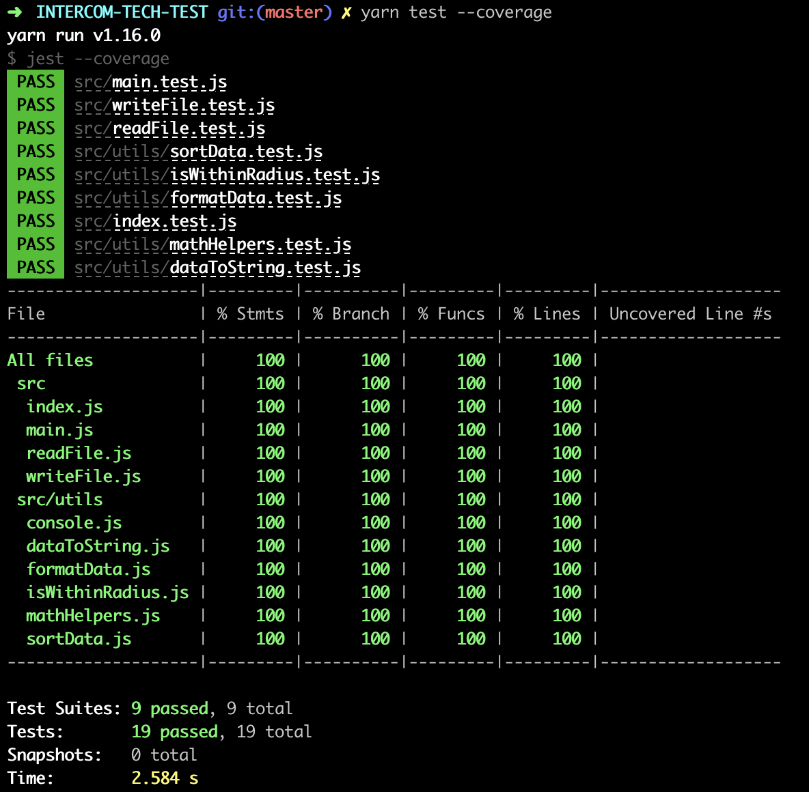
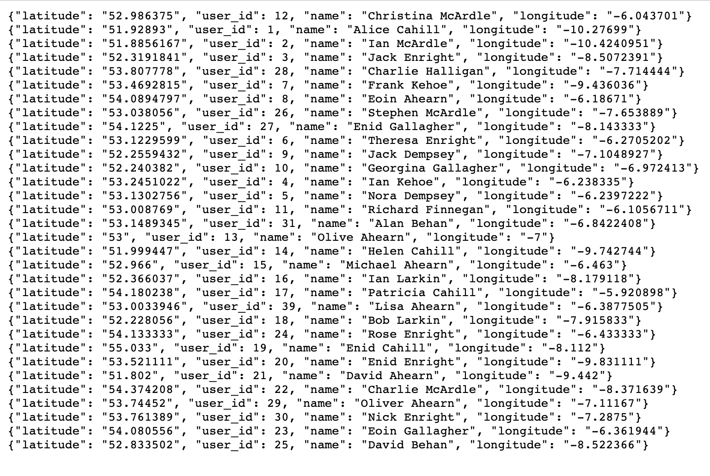

<!--- to preview in VSCode, use ⇧⌘V (shift + command + V) --->

# 🎙️ INTERCOM TECH TEST
📍🗺️📍🗺️📍🗺️📍🗺️📍🗺️📍
## "CLOSE CUSTOMERS"
🗺️📍🗺️📍🗺️📍🗺️📍🗺️📍🗺️

A barely-there, reusable program written in [Node.js](https://nodejs.org/en/docs) that:
- reads data from a .txt file,
- converts data to a JSON array,
- finds customers within a defined radius using the [great-circle distance formula](https://en.wikipedia.org/wiki/Great-circle_distance), and
- returns a new simplified _**output.txt**_ file of "close customers", sorted by _**user_id**_.

## HOW TO USE?
📌 In your teminal, run `git clone https://github.com/dani-boo/close-customers.git`  
📌 Go to directory by running `cd close-customers`  
📌 Run `yarn` to install dependencies

🚨**NB: You need `node` to run this project, which you can download from [here](https://nodejs.org/en/). If you don't know whether node is installed on your machine you can check with the command `node -v`, which will print your current node version to the console.**

**🌡️ TESTING:**  
Run tests with `yarn test`. See coverage report by running `yarn test --coverage`  

  
**💻 RUN PROGRAM:**  
Write/overwrite the `output.txt` file (in repo's _**public**_ folder) by going to src folder (`cd src`) and running _**writeFile**_ function inside index.js:  
`node index.js`  
(this also logs the result to the console) 

## [Sample input data:](https://s3.amazonaws.com/intercom-take-home-test/customers.txt)


## Sample filtered and sorted data (customers who are close enough):

```{"id": "4", "name": "Ian Kehoe"}
{"id": "5", "name": "Nora Dempsey"}
{"id": "6", "name": "Theresa Enright"}
{"id": "8", "name": "Eoin Ahearn"}
{"id": "11", "name": "Richard Finnegan"}
{"id": "12", "name": "Christina McArdle"}
{"id": "13", "name": "Olive Ahearn"}
{"id": "15", "name": "Michael Ahearn"}
{"id": "17", "name": "Patricia Cahill"}
{"id": "23", "name": "Eoin Gallagher"}
{"id": "24", "name": "Rose Enright"}
{"id": "26", "name": "Stephen McArdle"}
{"id": "29", "name": "Oliver Ahearn"}
{"id": "30", "name": "Nick Enright"}
{"id": "31", "name": "Alan Behan"}
{"id": "39", "name": "Lisa Ahearn"}
```
